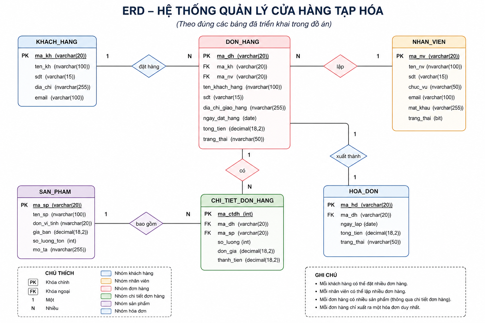

# HỆ THỐNG QUẢN LÝ CỬA HÀNG TẠP HÓA

## Giới thiệu

Hệ thống quản lý cửa hàng tạp hóa là dự án được xây dựng trong môn Công nghệ phần mềm nhằm hỗ trợ quản lý các hoạt động kinh doanh tại cửa hàng một cách khoa học và hiệu quả. Hệ thống giúp quản lý thông tin sản phẩm, khách hàng, nhà cung cấp, nhân viên, đơn hàng, hóa đơn và hỗ trợ thống kê doanh thu.

Dự án được thực hiện theo mô hình Agile/Scrum kết hợp sử dụng Jira để quản lý tiến độ công việc, Figma để thiết kế giao diện và GitHub để quản lý mã nguồn.

---

## Công nghệ sử dụng

### Thiết kế và quản lý dự án

* Jira
* Figma
* GitHub

### Phát triển hệ thống

* HTML5
* CSS3
* JavaScript

### Lưu trữ dữ liệu

* LocalStorage

---

## Chức năng chính

### Đăng nhập hệ thống

* Đăng nhập bằng tài khoản và mật khẩu.
* Phân quyền người dùng theo vai trò.

### Quản lý sản phẩm

* Thêm sản phẩm mới.
* Chỉnh sửa thông tin sản phẩm.
* Xóa sản phẩm.
* Tìm kiếm sản phẩm.
* Quản lý số lượng và giá bán.

### Quản lý khách hàng

* Thêm khách hàng.
* Chỉnh sửa thông tin khách hàng.
* Xóa khách hàng.
* Tìm kiếm khách hàng.

### Quản lý nhà cung cấp

* Thêm nhà cung cấp.
* Chỉnh sửa thông tin nhà cung cấp.
* Xóa nhà cung cấp.
* Tìm kiếm nhà cung cấp.

### Quản lý nhân viên

* Thêm nhân viên.
* Chỉnh sửa thông tin nhân viên.
* Xóa nhân viên.
* Tìm kiếm nhân viên.

### Quản lý đơn hàng

* Tạo đơn hàng.
* Cập nhật trạng thái đơn hàng.
* Theo dõi thông tin đơn hàng.

### Quản lý hóa đơn

* Tạo hóa đơn thanh toán.
* Xem danh sách hóa đơn.
* Theo dõi lịch sử giao dịch.

### Thống kê

* Thống kê doanh thu.
* Thống kê sản phẩm.
* Thống kê khách hàng.
* Thống kê nhà cung cấp.
* Hiển thị biểu đồ thống kê.

---

## Quy trình phát triển dự án

### Sprint 1

* Khảo sát yêu cầu hệ thống.
* Phân tích nghiệp vụ.
* Xây dựng Product Backlog.
* Xác định phạm vi dự án.

### Sprint 2

* Thiết kế giao diện bằng Figma.
* Thiết kế Use Case.
* Thiết kế cơ sở dữ liệu.
* Xây dựng sơ đồ ERD.

### Sprint 3

* Xây dựng giao diện Website.
* Lập trình các chức năng chính.
* Kiểm tra hoạt động của từng module.

### Sprint 4

* Kiểm thử hệ thống.
* Sửa lỗi.
* Hoàn thiện giao diện.
* Hoàn thiện báo cáo dự án.

---

## Cơ sở dữ liệu

Hệ thống được thiết kế cơ sở dữ liệu gồm các bảng:

* Loại sản phẩm
* Sản phẩm
* Khách hàng
* Nhà cung cấp
* Nhân viên
* Đơn hàng
* Chi tiết đơn hàng
* Hóa đơn
* Phiếu nhập
* Chi tiết phiếu nhập

File thiết kế cơ sở dữ liệu:

```text
database/database.sql
```

---

## Sơ đồ ERD

```text
database/ERD.png
```

---
## Giao diện Figma

### Trang đăng nhập


### Trang chủ


### Quản lý sản phẩm


### Quản lý khách hàng


### Quản lý nhà cung cấp


### Quản lý nhân viên


### Quản lý đơn hàng


### Quản lý hóa đơn


### Thống kê


## Cấu trúc thư mục dự án

## Liên kết Figma

Thiết kế giao diện hệ thống quản lý cửa hàng tạp hóa:

https://www.figma.com/design/YzkLVdqdBR0p2O3oTi6B9j/H%E1%BB%87-th%E1%BB%91ng-qu%E1%BA%A3n-l%C3%BD-c%E1%BB%ADa-h%C3%A0ng-t%E1%BA%A1p-h%C3%B3a?node-id=0-1&t=izB0yLwIXIKXGC07-1
```text

## Tài liệu phân tích hệ thống

### DFD mức ngữ cảnh


### DFD mức 1


### ERD




HETHONGQUANLYCUAHANGTAPHOA
│
├── database
│   ├── database.sql
│   └── ERD.png
│
├── src
│   ├── css
│   ├── js
│   ├── index.html
│   ├── sanpham.html
│   ├── khachhang.html
│   ├── nhacungcap.html
│   ├── nhanvien.html
│   ├── donhang.html
│   ├── hoadon.html
│   └── thongke.html
│
└── README.md
```

---

## Thành viên thực hiện

* Phan Thanh Phúc – MSSV: 110123160
* Phạm Thị Bảo Trâm – MSSV: 110123191
* Trương Hoàng Mãi – MSSV: 110123260

Lớp: DA23TTD

---

## Giảng viên hướng dẫn

ThS. Phạm Minh Đương

---

## Hướng dẫn chạy dự án

Bước 1: Mở Terminal.

Bước 2: Di chuyển đến thư mục mã nguồn:

```bash
cd src
```

Bước 3: Khởi chạy máy chủ cục bộ:

```bash
python3 -m http.server 8000
```

Bước 4: Mở trình duyệt và truy cập:

```text
http://localhost:8000
```

---

## Liên kết GitHub Pages

Website được triển khai trên GitHub Pages nhằm phục vụ việc trình diễn, kiểm thử và đánh giá dự án.

---

## Năm thực hiện

2026
